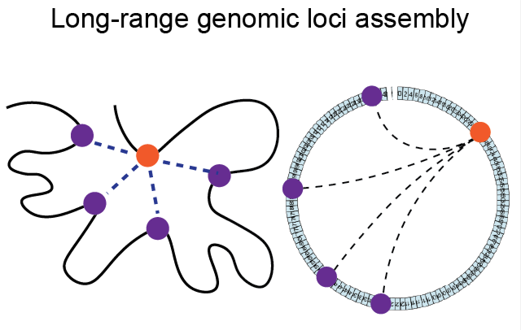

# Long-range Colocalizaiton (LRC) Notebooks
**Long-range genomic loci stochastically assemble 1 into combinatorial forms of chromosome skeleton** 
[Link ](https://doi.org/10.1101/2025.02.10.637328)

## Highlights
1. Spatial proximity of two well-seperated cis-loci (>100 Mb) is a prevelent and conserved strcuture of human chromosomes. 
2. While the most of long-range localizations (LRCs) are formed transicently and present infrequently in tested chromosome copies, ~5% of them recur in 0.8% to >10% subpopulations of entire chromosomes, thus considered as stable contacts.  
3. Multivalent binding is one of the possible mechanisms that ensure stable LRC structure.
4. A subset of genomic sites serves as nucleation centers (NCs) for clustering stable LRCs, assembling hub-like domains that may be associated with chromosome conformation and territory segregation.

## Hardware requirements
All codes requires a standard computer.

## Software requirements
R version 4.4.1

## OS requirements
These codes were supported for macOS, Linux, and Windows. The codes have been tested on the following systems:

macOS: Sonoma 14.5

Installing R version 4.4.1 on MacOS.

## R Dependencies
User should install the following packages prior to run the codes, from an R terminal:
> *circlize, dplyr, ggExtra, ggplot2, igraph, htmlwidgets, pheatmap, plotly, viridis*

## Expected output
The codes are used to generate figures and results in 
*Long-range genomic loci stochastically assemble into combinatorial forms of chromosome skeleton*

## Reproduction instructions
For codes to generate figures and results in Fig1 and extended Fig1-3, please download the Hi-C data as described in extended data table 1 and run the code Figure1.R.
For codes to generate figures and results in Fig2-Fig5 and extended Fig4-6, please download the MERFISH data of chrosmosome 2 and chromosome 21 from https://zenodo.org/records/3928890
